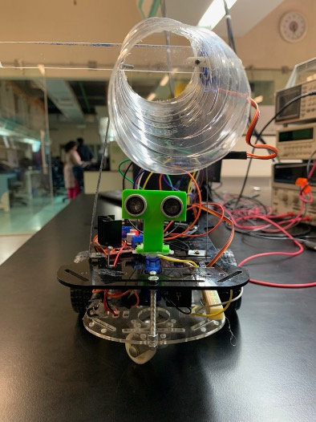
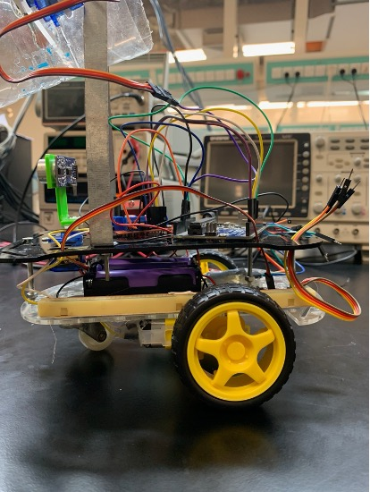
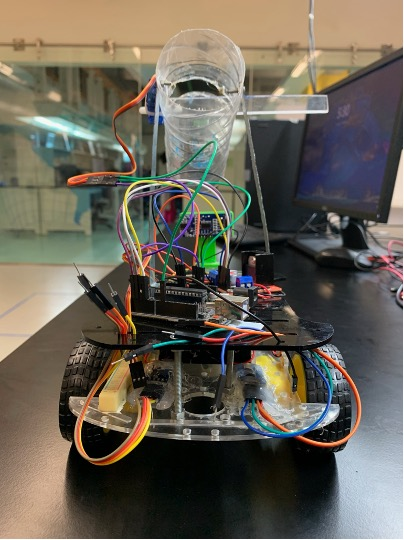
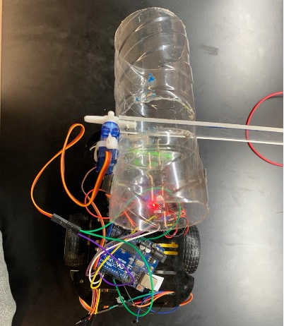

# Arduino Based Line Following Collision Avoiding Robot

## Images of the Robot

### Front View

### Side View

### Back View

### Top View

## General Logic & Working of our Robot

### Line Detection - Autonomous Mode

- There are two IR sensors attached below the car.
- The initial state of the car (or assumption) is that when we turn on the autonomous mode, it should be on top of the black line. 

#### Two White Detected

- As the two IR sensors are attached at the corner of the car, it wouldn’t be able to detect the black even if we are on a black line.
- We will be assuming that we are on the right track if this is the scenerio, and car will move forward.

#### One Black & One White Detected

- If there was a turn in the black line, and our robot is continuing to move forward, then it is natural that one of the corner sensors will detect the black line.
- When it does so, it would be a “sign” or “signal” for it to move “in that direction” accordingly.
- So, if the right sensor detects black, then the car will turn right, if the left sensor detects black, it will turn left.

#### Two Blacks Detected

- This shouldn’t technically ever happen, but it’s a don’t care, the robot will continue moving forward.
- For our ultra-sonic, if it detects an obstacle, it will initiate two things!

#### Unloading Mechanism

- The servo motor will be written over, and the balls that have been loaded in the chamber will be unloaded.

#### Obstacle Avoidance Mechanism

- Before initiating the protocol, the servo motor attached underneath the ultra-sonic sensor will rotate right and left.
- The point of it is to see whether there are walls on the right or the left.
- Our protocol makes the car choose either left or right, move forward a bit, then right or left, then move forward, ideally allowing it to skip the obstacle that was between the lines!
- If there is a wall on the right, then the robot will initiate the protocol on the left (we don’t want the robot to accidentally crash into the right).

### Manual Mode

- In this mode, the Arduino will be waiting for the Bluetooth module which will be connected to our mobile phone.
- There, whenever it receives a character, it will do the assigned action accordingly.

## Sensor Communication Protocols Used

Going through the communication protocols that were used in our projects:

### Sensors

- IR Sensor/Encoder use a simple digital protocol, it doesn’t use either UART, SPI, or I2C, but rather a straight-forward simple on-off keying digital protocol.
- Servo Motor use PWM (Pulse Width Modulation)
- Ultra-sonic use timing-based digital protocol.
- Neither of them using any kind of UART, SPI, or I2C.

### Arduino UNO

- Although the microcontroller is able to support all kinds of protocols, we aren’t using all of them.
- The communication protocol between the Arduino and the Bluetooth module (HC-05 module) is UART (Universal Asynchronous Receiver/Transmitter) also commonly known as serial communication.
- It is sort of obvious as well, cause we can clearly observe the connection between the transmitter of the Bluetooth module to the receiver of the Arduino, and the receiver of it to the transmitter (showcasing Full-duplex) as well.

---

- Communication between the Bluetooth module and Arduino aside, the communication protocol that is used between “Bluetooth” and Mobile Phones” is not UART, and is SPP (Bluetooth Serial Port Protocol). 
- Our Project doesn’t really use I2C or SPI Protocol.
- It’s not like we are using Audio IC, Real-time clock, ADC or DAC converters that we would need an SPI Protocol for. 

---

### Contributors

- [Shah Jahan Sangrassi](https://github.com/Shahjahan07)
- [Syed Asghar Abbas Zaidi](https://github.com/AsgharAZ)
- [Huzaifah Tariq Ahmed](https://github.com/huzaifahtariqahmed)
